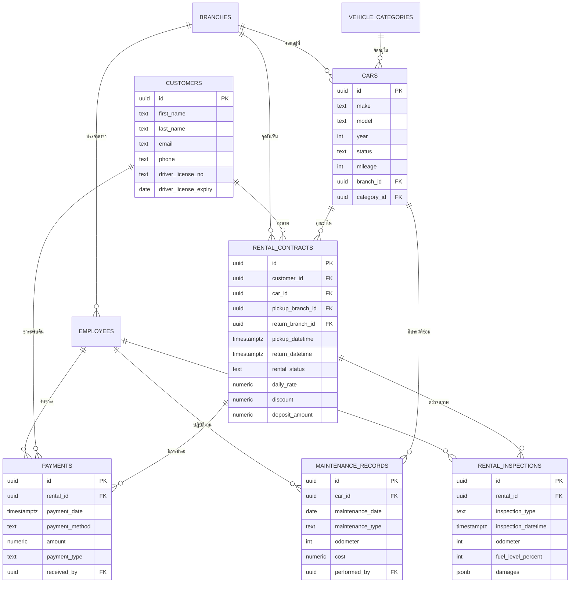

# ER Diagram – Car Rental Manager

> แผนภาพนี้สรุปความสัมพันธ์หลักของสคีมา `car_rental` ใน Supabase โดยใช้สัญลักษณ์ Mermaid ER Diagram  
> หมายเหตุ: ปรับเปลี่ยนได้ตาม requirement จริงในระหว่างการพัฒนา

## การใช้งาน
- สามารถคัดลอกโค้ด Mermaid ไปวางใน Markdown viewer ที่รองรับ (เช่น VS Code, Obsidian, GitLab/GitHub ที่เปิดใช้ Mermaid) เพื่อดูผังความสัมพันธ์
- หากต้องการไฟล์รูปภาพ ให้ใช้ Mermaid CLI หรือ https://mermaid.live แปลงเป็น PNG/SVG

---
> ERD ฉบับนี้จัดทำเพื่อประกอบเอกสารสถาปัตยกรรมและช่วยทีม dev/analyst เข้าใจโครงสร้างข้อมูลหลัก
